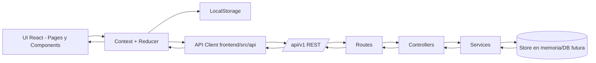

# Arquitectura de la aplicacion: FocusSprint

## 1) Estructura de componentes principales (frontend)

Base en `frontend/src`:

- `pages/`
  - `HomePage`: vista principal del dia (tareas, temporizador, progreso).
  - `StatsPage` (futuro): resumen semanal.
  - `SettingsPage` (futuro): preferencias de sesion y UI.
- `components/layout/`
  - `AppShell`: layout general (header, contenido, footer).
  - `TopBar`: titulo, fecha, accesos rapidos.
- `components/tasks/`
  - `TaskComposer`: crear tarea.
  - `TaskList`: lista de tareas del dia.
  - `TaskItem`: item individual (toggle, editar, eliminar).
  - `TaskFilters`: filtro por estado/etiqueta.
- `components/focus/`
  - `FocusTimer`: temporizador principal.
  - `SessionControls`: iniciar, pausar, reiniciar.
  - `BreakTimer` (opcional): descanso corto.
- `components/progress/`
  - `DailyProgressCard`: tareas completadas y sesiones.
  - `StreakBadge`: racha diaria.
- `components/common/`
  - `Button`, `Input`, `Modal`, `EmptyState`, `Loader`, `Badge`.

## 2) Componentes reutilizables

Se consideran reutilizables en todo el proyecto:

- UI base: `Button`, `Input`, `Select`, `Modal`, `Card`, `Badge`.
- Feedback: `Toast`, `Loader`, `EmptyState`.
- Utilidades de presentacion: `PageHeader`, `SectionTitle`, `ConfirmDialog`.
- Hooks reutilizables:
  - `useLocalStorage<T>()`: persistencia local tipada.
  - `useTimer()`: logica de cuenta regresiva.
  - `useDailyReset()`: reseteo automatico por cambio de dia.

## 3) Gestion del estado de la aplicacion

Estrategia hibrida (simple y escalable):

- **Estado global (React Context + reducer)**
  - `AppContext`: usuario local anonimo, tareas del dia, sesiones, preferencias.
  - Acciones: `taskAdded`, `taskUpdated`, `taskCompleted`, `sessionStarted`, `sessionFinished`, `settingsUpdated`.
- **Estado local de componente**
  - Formularios temporales, estados de UI (modales abiertos, filtros de vista).
- **Estado remoto**
  - Datos del backend cargados bajo demanda (ej. catalogo de frases o seeds).
  - Se acceden mediante `api/client.ts` y servicios en `src/api/`.

Flujo recomendado:

1. UI dispara accion.
2. Reducer actualiza estado en memoria.
3. Se persiste en `LocalStorage` (debounce corto).
4. Si aplica, se sincroniza con API (modo online).

## 4) Diseno de backend/API

Base URL versionada:

- `/api/v1`

Recursos REST del MVP:

### Health
- `GET /api/v1/health`
  - Uso: verificar disponibilidad del backend.
  - Respuesta `200`:
    ```json
    {
      "status": "ok",
      "service": "focussprint-api",
      "version": "v1"
    }
    ```

### Tasks
- `GET /api/v1/tasks?date=YYYY-MM-DD`
  - Devuelve tareas del dia.
- `POST /api/v1/tasks`
  - Crea tarea.
- `PATCH /api/v1/tasks/:taskId`
  - Actualiza campos parciales (titulo, estado, etiqueta, etc.).
- `DELETE /api/v1/tasks/:taskId`
  - Elimina tarea.

Contrato `Task`:

```json
{
  "id": "tsk_123",
  "title": "Preparar resumen de clase",
  "status": "pending",
  "priority": "medium",
  "tags": ["estudio"],
  "estimatedPomodoros": 2,
  "completedAt": null,
  "createdAt": "2026-04-20T09:00:00.000Z",
  "updatedAt": "2026-04-20T09:00:00.000Z",
  "date": "2026-04-20"
}
```

### Sessions
- `GET /api/v1/sessions?date=YYYY-MM-DD`
  - Lista sesiones de enfoque del dia.
- `POST /api/v1/sessions`
  - Registra una sesion finalizada.

Contrato `Session`:

```json
{
  "id": "ses_456",
  "taskId": "tsk_123",
  "durationMinutes": 25,
  "type": "focus",
  "finishedAt": "2026-04-20T09:30:00.000Z",
  "date": "2026-04-20"
}
```

### Stats
- `GET /api/v1/stats/daily?date=YYYY-MM-DD`
  - Resumen diario calculado por backend.

Respuesta ejemplo:

```json
{
  "date": "2026-04-20",
  "tasksTotal": 6,
  "tasksCompleted": 4,
  "sessionsCompleted": 5,
  "focusMinutes": 125,
  "streakDays": 3
}
```

### Seeds (opcional para desarrollo)
- `GET /api/v1/seeds/demo`
  - Entrega datos de ejemplo para poblar la app en onboarding o demo.

## 5) Persistencia: servidor vs cliente

### Persistido en servidor
- Tareas del usuario (si modo online/sync activo).
- Sesiones completadas.
- Estadisticas agregadas por dia.

### Persistido solo en cliente
- Estado de UI (filtro activo, modal abierto).
- Temporizador en curso (estado efimero con backup en `LocalStorage`).
- Preferencias locales rapidas:
  - tema;
  - duracion por defecto de sesion;
  - activar/desactivar sonido.

### Estrategia offline-first del MVP
- Fuente principal: `LocalStorage`.
- Sincronizacion con API opcional y progresiva.
- Si falla API: la app sigue usable con datos locales.

## 6) Flujo de datos (frontend ↔ API ↔ backend)



## 7) Decisiones de arquitectura (resumen)

- React + TypeScript para tipado y mantenibilidad.
- Tailwind CSS para UI rapida y consistente.
- React Router para separar paginas y escalar navegacion.
- Context + reducer para estado de negocio sin sobrecargar el stack.
- API REST versionada en `/api/v1` para evolucion sin romper clientes.
- Enfoque offline-first: experiencia funcional incluso sin backend.
